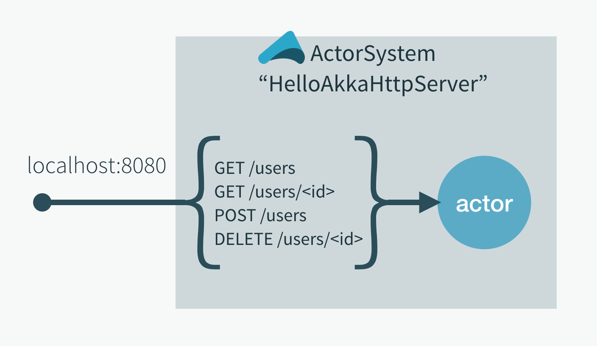

Akka HTTP Quickstart for Scala
==============================

Akka HTTP offers a general toolkit for providing and consuming HTTP-based services. The Akka HTTP modules implement a full server- and client-side HTTP stack on top of `akka-actor` and `akka-stream`. A typical application does not sit on top of Akka HTTP. Instead, Akka HTTP makes it easier to build integration layers based on HTTP, and therefore stays on the sidelines. This allows you to base your app on what makes sense and use Akka HTTP for HTTP integration.

Akka HTTP is not a framework--not because we don't like frameworks--but to provide maximum flexibility. For example, you might use the Play framework to implement browser-based interactions or Lagom framework for creating microservices, both of them are also based on Akka.

Akka HTTP follows a rather open design and often offers several APIs for accomplishing the same thing. You can choose the API with the level of abstraction that best suits your application.  If you have trouble achieving something using a high-level API, you can probably find a lower-level API to use. The low-level APIs offer more flexibility, but might require you to write more application code.

This guide highlights Akka HTTP fundamentals in the context of a simple user registry [REST service](https://en.wikipedia.org/wiki/Representational_state_transfer). Within 30 minutes, you should be able to:

* Download the quickstart project and run the app.
* Follow this guide to explore the code.
* Integrate the project into IntelliJ. If you prefer a different IDE, the principles should be similar, as long as it supports Scala.

## Prerequisite

Having a basic understanding of Akka actors will make it easier to understand the example.
If you are new to Akka, we recommend completing the
@extref[Akka Quickstart](akka-docs:typed/actors.html#first-example) before this tutorial.

You can run the Akka HTTP example project on Linux, MacOS, or Windows. The only prerequisite is Java 17 or later.

## Downloading the example

The Akka HTTP example for Scala is a zipped project that includes a distribution of the [sbt](http://www.scala-sbt.org) build tool. Download and unzip the example as follows:

1. Download the project [zip file](../attachments/akka-http-quickstart-scala.zip).
2. Extract the zip file to a convenient location.

* On Linux and MacOS systems, open a terminal and use the command `unzip` akka-quickstart-scala.zip. Note: On OSX, if you unzip using Archiver, you also have to make the sbt files executable by entering the following two commands:

```
$ chmod u+x ./sbt
$ chmod u+x ./sbt-dist/bin/sbt
```

* On Windows, use a tool such as File Explorer to extract the project.

Alternatively, you can bootstrap a new project with Akka HTTP already configured using the [Giter8](http://www.foundweekends.org/giter8/) template directly via sbt:

```sh
sbt new akka/akka-http-quickstart-scala.g8
```

## Running the example

To run Hello World:

In a console, change directories to the top level of the unzipped project.

For example, if you used the default project name, `akka-http-quickstart`, and extracted the project to your root directory, from the root directory, enter: `cd akka-http-quickstart`

Start sbt:

  * On OSX or Linux systems, enter `./sbt`
  * On Windows systems, enter `sbt.bat`.

When you run sbt, it downloads project dependencies. The `>` prompt indicates that sbt is running in interactive mode.

At the sbt prompt, enter `reStart`.

sbt builds the project, starts an Akka HTTP server, and runs the example application.

The output should look something like this:

```
[info] Loading global plugins from /Users/x/.sbt/0.13/plugins
...
[info] Running com.example.QuickstartServer
[2019-10-24 15:26:39,182] [INFO] [HelloAkkaHttpServer] [HelloAkkaHttpServer-akka.actor.default-dispatcher-3] [akka://HelloAkkaHttpServer/user/HttpServer] - Server online at http://127.0.0.1:8080/
```

The Akka HTTP server is now running, and you can test it by sending simple HTTP requests.

You can restart it by entering `reStart` again, and stop it with `reStop`.
To restart your application each time a change is detected, run `~reStart`.

## Example app overview

The user registry example contains functionality for adding, retrieving, or deleting a single user and for  retrieving all users. Akka HTTP provides a [domain-specific language](https://en.wikipedia.org/wiki/Domain-specific_language) (DSL) to simplify the definition of endpoints as a `Route`. In this example, a `Route` defines: the paths `/users` and `/user`, the available HTTP methods, and when applicable, parameters or payloads.

When the example app starts up, it creates an ActorSystem with a `UserRegistry` Actor and binds the defined routes to a port, in this case, `localhost:8080`. When the endpoints are invoked, they interact with the `UserRegistry` Actor, which contains the business logic. The diagram below illustrates runtime behavior, where that the HTTP server receives for the defined `route` endpoints, which are handled by the `UserRegistry` actor:



## Exercising the example

To get started, try registering and retrieving a few users. You simply need to know the appropriate parameters for the requests. In our example app, each user has a  `name`, an  `age`, and a `countryOfResidence`.

You pass request parameters in JSON format. While you could do this in a browser, it is much simpler to use one of the following:

* A command line tool, such as [cURL](https://en.wikipedia.org/wiki/CURL).
* Browser add-ons such as [RESTClient](http://restclient.net/) for Firefox or Postman for Chrome.

Follow the steps appropriate for your tool:

* [cURL commands](#cURL-commands)
* [Browser-based tools](#Browser-based-tools)

### cURL commands

Open a shell that supports cURL and follow these steps to add and retrieve users:

Copy and paste the following lines to create a few users (enter one command at a time):

```
curl -H "Content-type: application/json" -X POST -d '{"name": "MrX", "age": 31, "countryOfResidence": "Canada"}' http://localhost:8080/users

curl -H "Content-type: application/json" -X POST -d '{"name": "Anonymous", "age": 55, "countryOfResidence": "Iceland"}' http://localhost:8080/users

curl -H "Content-type: application/json" -X POST -d '{"name": "Bill", "age": 67, "countryOfResidence": "USA"}' http://localhost:8080/users
```

The system should respond after each command to verify that the user was created.

To retrieve all users, enter the following command:

```
curl http://localhost:8080/users
```

The system responds with the list of users:

```
{"users":[{"name":"Anonymous","age":55,"countryOfResidence":"Iceland"},{"name":"MrX","age":31,"countryOfResidence":"Canada"},{"name":"Bill","age":67,"countryOfResidence":"USA"}]}
```

To retrieve a specific user, enter the following command:

```
curl http://localhost:8080/users/Bill
```

The system should respond with the following:

```
{"name":"Bill","age":67,"countryOfResidence":"USA"}
```

Finally, it is possible to delete users:

```
curl -X DELETE http://localhost:8080/users/Bill
```

The response should be:

```
User Bill deleted.
```

### Browser-based clients

Open a tool such as RESTClient or Postman and follow these steps to create and retrieve users:

To create users:

1. Select the `POST` method.
1. Enter the URL: `http://localhost:8080/users`
1. Set the Header to `Content-Type: application/json`.
1. In the body, copy and paste the following lines to create three users (send each payload separately). Note: for Postman, you might need to specify that you want to send `raw` data.

```
{"name": "MrX", "age": 31, "countryOfResidence": "Canada"}

{"name": "Anonymous", "age": 55, "countryOfResidence": "Iceland"}

{"name": "Bill", "age": 67, "countryOfResidence": "USA"}
```

The system should respond after each command to verify that the user was created.

To retrieve all users:

1. Select the `GET` method.
1. Enter the URL: `http://localhost:8080/users`
1. Send the request.

The system should respond with a list of users in JSON format.

## Learning from the example

Congratulations, you just ran and exercised your first Akka HTTP app! You got a preview of how routes make it easy to communicate over HTTP.

The example is implemented in the following four source files:

* `QuickstartApp.scala` -- contains the main method which bootstraps the application 
* `UserRoutes.scala` -- Akka HTTP `routes` defining exposed endpoints
* `UserRegistry.scala` -- the actor which handles the registration requests
* `JsonFormats.scala` -- converts the JSON data from requests into Scala types and from Scala types into JSON responses

First, let's dissect the backend logic.

@@@index

* [The Actor backend](backend-actor.md)
* [The HTTP server](http-server.md)
* [JSON](json.md)
* [Running the application](running-the-application.md)
* [Testing Routes](testing-routes.md)
* [IntelliJ IDEA](intellij-idea.md)

@@@
